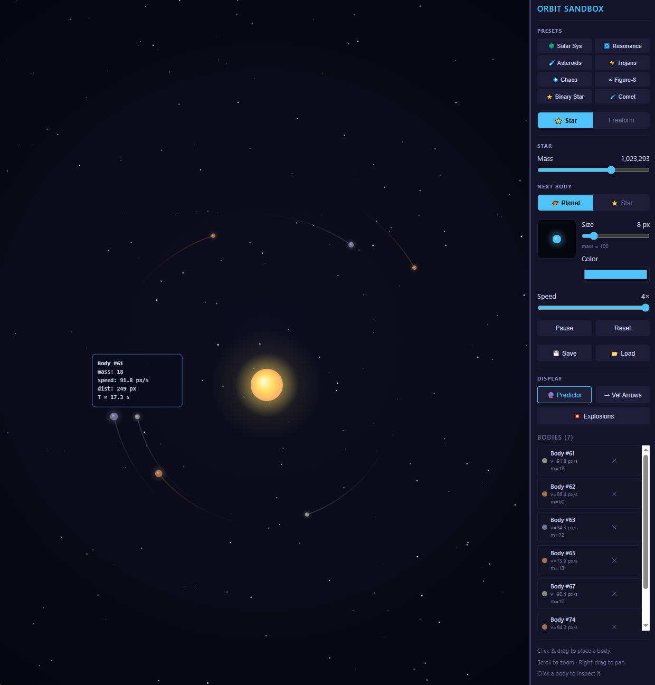

# Orbital 💫

A 2D orbital mechanics sandbox built with HTML5 Canvas and vanilla JavaScript. Place bodies by clicking and dragging — drag direction sets the launch velocity. All bodies exert Newtonian gravity on each other.



## Running

No build step required. Serve the directory with any static file server:

```bash
uv run python -m http.server 8080
```

Then open `http://localhost:8080`.

## Controls

| Action | Result |
|---|---|
| Click + drag on canvas | Place a body (drag direction = launch direction) |
| Scroll wheel | Zoom in/out (centred on cursor) |
| Right-click + drag | Pan the camera |
| Click a body | Inspect it (shows mass, velocity, orbit info) |
| Size slider | Set radius of next body (3–40 px) |
| Color picker | Set color of next body |
| Speed slider | Time warp: ¼× to 4× real-time |
| Pause / Resume | Freeze/unfreeze the simulation |
| Reset | Remove all bodies (star remains) |
| 💾 Save / 📂 Load | Persist the current scene to localStorage |
| ✕ button on body | Remove that body |

## Features

### Two simulation modes
- **Star mode** — a fixed central star provides a dominant gravitational anchor. Good for planetary systems.
- **Freeform mode** — no central star; pure N-body gravity. Good for multi-star systems and three-body problems.

### Orbit predictor
While dragging to place a body, a dashed line previews the orbit the body will follow (600-step lookahead using star gravity). Helps dial in circular orbits and ellipses before you let go.

### Inspector
Short-click any body to open an overlay showing its current position, velocity, mass, and orbital energy. Click elsewhere to dismiss.

### Camera
Scroll to zoom (centred on the cursor) and right-click drag to pan. The view resets to centre on preset load.

### Time warp
The speed slider runs from ¼× to 4× real-time (in half-stop increments). Useful for watching slow outer-planet orbits or following a fast comet perihelion.

### Velocity arrows
Toggle velocity arrows to see each body's current speed and direction at a glance.

### Explosions
Toggle explosion effects on body collisions.

### Save / Load
Snapshot the full scene (mode, star mass, all body positions and velocities) to `localStorage` and restore it later.

## Presets

| Preset | Mode | Description |
|---|---|---|
| 🌍 Solar Sys | Star | Five planets at Mercury–Jupiter distances with circular orbital velocities |
| 🔄 Resonance | Star | Three planets in a 1:2:4 Laplace resonance (like Io/Europa/Ganymede) |
| ☄️ Asteroids | Star | 15-body asteroid belt with slight eccentricity variation |
| ⚡ Trojans | Star | Jupiter analog + two Trojan groups at the L4 and L5 Lagrange points |
| 🌀 Chaos | Star | Three massive bodies with mismatched eccentricities → chaotic precession |
| ∞ Figure-8 | Freeform | Chenciner–Montgomery periodic three-body solution: three equal masses chasing a figure-8 |
| ⭐ Binary Star | Freeform | Two orbiting stars with a circumbinary planet — watch the planet's non-circular path |
| 🌠 Comet | Star | Highly eccentric comet (e=0.8); watch it whip around perihelion at 2–4× speed |

## Tips

- For a stable circular orbit, drag **tangentially** (perpendicular to the line toward the star). The orbit predictor shows the resulting path before you release.
- Drag **radially inward** and the body falls into the star.
- Drag **outward fast** and the body escapes the system (pruned automatically at 5,000 px).
- Bodies that collide **merge** — momentum and volume are conserved.
- In **Freeform** mode the centre of the escape-detection zone is the canvas centre, not a star.
- The Figure-8 preset is numerically sensitive — it stays periodic for ~5–10 orbits, then slowly drifts (expected behaviour for any finite-step integrator).

## Physics

- **Integrator**: Velocity Verlet with 4 substeps per frame — conserves energy well for stable closed orbits.
- **Gravity**: Full N-body O(n²) pairwise forces + optional fixed star. Softening factor of 5 px prevents force spikes at close range.
- **Collisions**: Bodies merge when they overlap; momentum and mass are conserved. Optional explosion fragments.
- **Constants**: G=2.0, default star mass=1,000,000, escape radius=5,000 px.

## File Structure

```
index.html
css/style.css
js/
  main.js       ← entry point
  Game.js       ← rAF loop, owns bodies[]
  Body.js       ← CelestialBody, Star data classes
  Physics.js    ← integrator, collisions, escape detection
  Renderer.js   ← canvas drawing pipeline
  Input.js      ← mouse/touch event handling
  UI.js         ← sidebar panel
  Presets.js    ← preset scenario definitions
```
