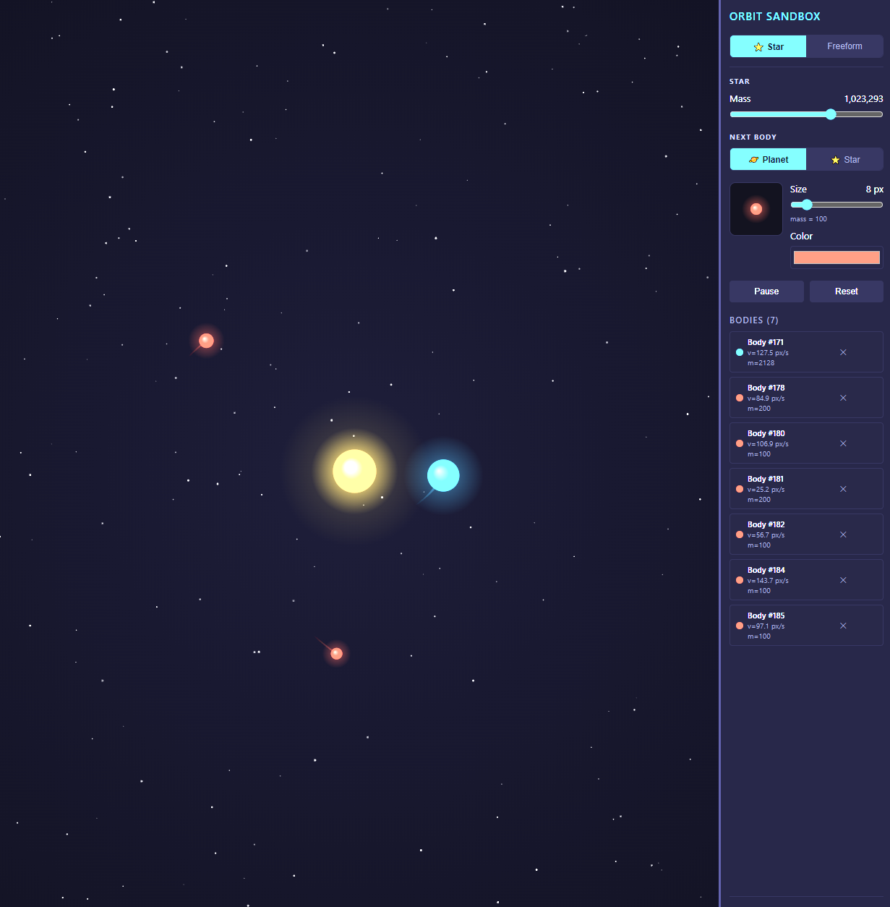

# Orbit Game

A 2D orbital mechanics sandbox built with HTML5 Canvas and vanilla JavaScript. Place bodies by clicking and dragging — drag direction sets the launch velocity. All bodies exert Newtonian gravity on each other.



## Running

No build step required. Serve the directory with any static file server:

```bash
uv run python -m http.server 8080
# or
python3 -m http.server 8080
```

Then open `http://localhost:8080`.

## Controls

| Action | Result |
|---|---|
| Click + drag on canvas | Place a body (drag direction = launch direction) |
| Mass slider | Set mass of next body (logarithmic: 1–10,000) |
| Radius slider | Set radius of next body (3–40 px) |
| Color picker | Set color of next body |
| Pause / Resume | Freeze/unfreeze the simulation |
| Reset | Remove all bodies (star remains) |
| ✕ button on body | Remove that body |

## Tips

- For a stable circular orbit, drag **tangentially** (perpendicular to the line toward the star). The placement arrow shows your current speed vs. the circular orbit speed at that distance (`v_circ`).
- Drag **radially inward** and the body falls into the star.
- Drag **outward fast** and the body escapes the system (pruned automatically).
- Bodies that collide **merge** — momentum and volume are conserved.

## Physics

- **Integrator**: Velocity Verlet with 4 substeps per frame — conserves energy well enough for stable closed orbits.
- **Gravity**: Full N-body O(n²) pairwise forces + star. Softening factor of 5 px prevents force spikes at close range.
- **Constants**: G=2.0, star mass=1,000,000, escape radius=5,000 px.

## File Structure

```
index.html
css/style.css
js/
  main.js       ← entry point
  Game.js       ← rAF loop, owns bodies[]
  Body.js       ← CelestialBody, Star data classes
  Physics.js    ← integrator, collisions, escape detection
  Renderer.js   ← canvas drawing pipeline
  Input.js      ← mouse/touch event handling
  UI.js         ← sidebar panel
```
